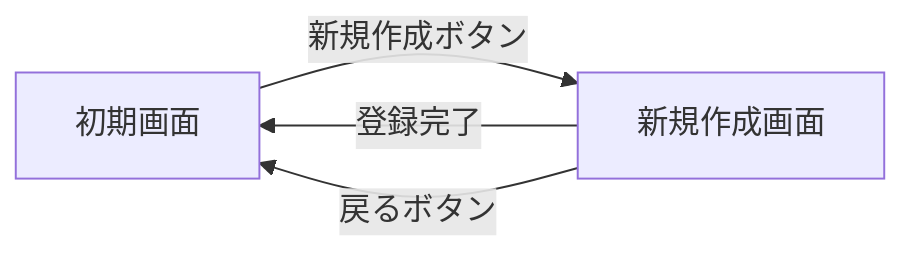
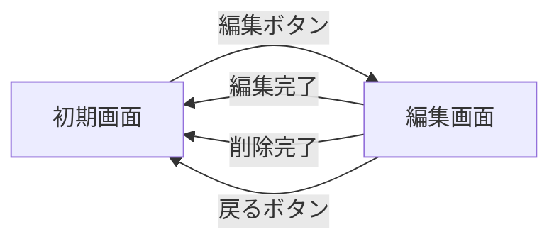

まずは､各画面の作成と画面遷移｡  
axiosとかの通信系は後で｡  

vue routerでredirectの仕様を確認するためのテスト作らないと

taskコンポーネント作成  
axiosで通信

# 画面遷移

# 新規
* ~~データ送信~~
* ~~画面遷移~~
* 遷移した画面へのフラッシュメッセージ

# 編集
* ~~でーた読み込み~~
    * ~~データ表示~~
* ~~でーた送信~~
* ~~削除申請~~
* ~~画面遷移~~
* 遷移した画面へのフラッシュメッセージ

# index
* ~~全件読み込み~~
    * ~~データ表示~~
* ~~新規画面への遷移~~
* ~~編集画面への遷移~~
* ~~タスク完了~~
* ~~検索~~

# 検索
1. 画面が表示されるときにクエリを習得
1. クエリを検索関数に突っ込んで送信
1. 出てきたデータを表示

# 検索ボタンおしたら
クエリを与えた状態で再読み込み?

