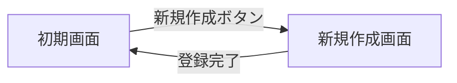
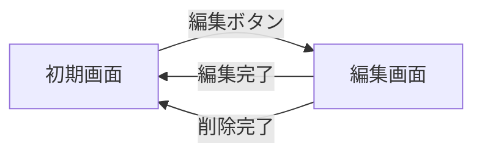

まずは､各画面の作成と画面遷移｡
axiosとかの通信系は後で｡

# 画面遷移

```mermaid
flowchart LR

index[初期画面] -->| 新規作成ボタン | create[新規作成画面]
create--> | 登録完了 | index


```

```mermaid
flowchart LR

index[初期画面] -->| 編集ボタン | edit[編集画面]
edit--> | 編集完了 | index
edit--> | 削除完了 | index

```